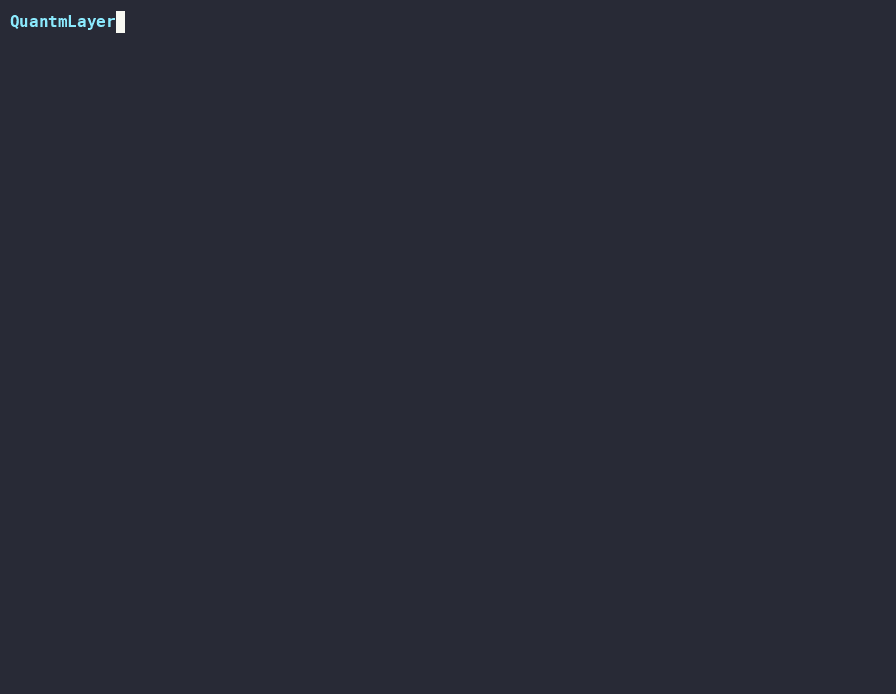

# QuantmLayer

[](https://github.com/quantmlayer/quantmlayer/actions/workflows/ci.yml)

**A security runtime for coding agents.** We don't secure what agents *say* — we secure what agents are *allowed to do*.

An autonomous coding agent runs with your shell's privileges: it can read `~/.ssh/id_rsa`, exfiltrate secrets, exhaust the host, ptrace other processes, or hit the cloud-metadata endpoint to steal cloud credentials. QuantmLayer wraps the agent in a kernel-enforced containment cell built from a portable, declarative profile, so a compromised or prompt-injected agent can't reach anything it wasn't explicitly granted.

> **▶ See it in 45 seconds:** [`demo/`](demo/) runs the whole loop — *learn* a least-privilege profile by watching a coding agent, then watch the **same** profile block an SSH-key theft the agent never performed.
>
> 


## Quickstart

```sh
cargo build --release

# THE MOAT — learn a least-privilege profile by observing an agent, then
# enforce it. The generated profile reruns the agent fine but denies everything
# it never needed (SSH keys, ptrace, network, binaries it never ran, ...):
ql learn --out agent.yaml -- ./my-agent build
ql run   --profile agent.yaml -- ./my-agent build

# Run a coding agent inside a containment cell:
ql run --profile profiles/coding.yaml -- my-agent --task "fix the failing test"

# Same, but with brokered egress: the agent's ONLY network route is the
# broker, which allows the profile's domains (e.g. pypi.org) and refuses
# everything else, including the cloud-metadata endpoint:
ql run --broker --profile profiles/coding.yaml -- my-agent --task "..."

# Inspect what a profile will enforce:
ql validate --profile profiles/coding.yaml

# Export the learned policy to a portable format other runtimes consume — an
# OCI/Docker seccomp profile, or a `docker run` invocation. Each export is
# explicit about what the target can and can't enforce (the gaps are where
# local containment still matters):
ql export --profile agent.yaml --format seccomp --out ql-seccomp.json
ql export --profile agent.yaml --format docker  --out run.sh

# Tamper-evident audit log: append hash-chained records of what the agent
# attempted (e.g. egress decisions), then verify the chain. Anyone you hand the
# log to can verify it wasn't altered — they don't have to trust the producer:
ql audit append run.log --actor broker --action egress.connect \
  --target 169.254.169.254:80 --decision deny --detail "cloud metadata blocked"
ql audit verify run.log

# Kill switch: list running cells, then revoke one instantly and completely —
# the agent and every process it spawned — recording the revocation in the log:
ql ps
ql kill <id> --audit run.log

# Agent identity + delegation tokens: authority that only narrows down the
# agent tree (Ed25519). The demo issues a grant, attenuates it to a sub-agent,
# and shows a broadening attempt rejected:
ql token demo

# Run the egress broker on its own (allow-listed network access):
ql broker --profile profiles/coding.yaml --listen 127.0.0.1:8080
```

`ql run` is transparent: the command's output passes through and `ql` exits with the command's own exit code.

## What it blocks

Every row below is measured by a reproducible benchmark (`make benchmark`) — never asserted. **Docker** is a default `docker run` with the workspace mounted (no hardening flags); each attack's exact scenario and target wall is documented under [`benchmark/`](benchmark/), and the live scorecard is regenerated into [`benchmark/RESULTS.md`](benchmark/RESULTS.md) on every run.

| Attack | Wall | No containment | Docker | QuantmLayer |
|---|---|---|---|---|
| SSH private-key theft | mount | vulnerable | blocked | blocked |
| Read secrets outside the workspace | mount | vulnerable | blocked | blocked |
| Resource exhaustion (fork bomb) | cgroups | vulnerable | vulnerable | blocked |
| Cross-process memory read / ptrace | seccomp | vulnerable | vulnerable | blocked |
| Cloud-metadata SSRF | network | vulnerable | vulnerable | blocked |
| Run an unauthorized tool (content-addressed exec) | exec | vulnerable | vulnerable | blocked |

A default container blocks the two filesystem attacks (separate container filesystem) but is exposed to the fork bomb, cross-process `ptrace`, and metadata SSRF — each of which needs a flag the operator must know to add (`--pids-limit`, a tightened seccomp profile, `--network none`). The last row is the sharpest: **content-addressed execution has no container flag to add.** A default container runs any binary it ships; QuantmLayer hashes every binary at `execve` and admits only those on the learned allow-list, so a tool the agent never used — a freshly dropped payload, a `curl` pulled in by a prompt injection — cannot start, denied by the kernel on content. QuantmLayer derives and applies all of these restrictions automatically, from the agent's observed behavior, on the real host filesystem with no separate image.

The exec row needs more than the others to reproduce: a kernel with BPF-LSM + IMA (check with [`scripts/ql-kernel-probe.sh`](scripts/ql-kernel-probe.sh)), an `lsm`-feature build, and root to load the BPF program — `cargo build --release -p ql-bench --features lsm && sudo ./target/release/ql-bench`. A default (toolchain-free) `make benchmark` runs the other five rows and honestly reports the exec row's QuantmLayer cell as `unsupported` rather than a fake block.

## How this differs from cloud sandboxes

Cloud sandboxes solve a related problem a different way: they run the agent on a **separate remote machine**. That gives strong host isolation — your laptop's files, SSH keys, and other secrets are never present on the remote sandbox, so there is nothing there to steal, and a runaway process is contained to a rented machine rather than yours. For running untrusted, AI-*generated* code, that model is a great fit.

The trade-offs are the other side of the same coin:

- The agent operates on a copy on someone else's infrastructure, not on your **real local files** — you sync code up and results back, which doesn't fit an agent meant to work directly in your existing repo, toolchain, and environment.
- You **entrust execution and your code** to a third-party cloud.
- Isolation stops at the host boundary, not *within* the sandbox: unless the provider restricts it, an agent inside the sandbox still has broad latitude over that machine's resources and network (including, potentially, the cloud instance-metadata endpoint).

QuantmLayer is built for the opposite situation: contain an agent running **locally, on your own machine and your real files**, with a least-privilege profile learned from its behavior — no remote machine, no code-sync, no third-party trust. The two approaches are complementary; this benchmark scores host-threat containment, which is QuantmLayer's domain, so remote-execution sandboxes are described here rather than scored as a column.

## Architecture

The system is a small Cargo workspace of focused crates:

- **`ql-profile`** — the portable, OS-independent policy model (pure data; no OS dependencies). A profile declares filesystem, network, syscall, capability, and resource rules.
- **`ql-learn`** — the *learning* half, and the moat. It traces an agent's real syscalls (`openat`/`open` with read/write intent, `execve`, `connect`) via `ptrace`, then synthesizes a least-privilege profile from what the agent actually needed. Enforcement is mechanical; deciding *what* to enforce is the defensible part. This is the dynamic counterpart to Decap's static capability derivation.
- **`ql-enforce`** — the Linux enforcement engine. Each containment mechanism is an `Enforcer` (mount, namespaces, cgroups, seccomp, network, and — behind the `lsm` feature — content-addressed `execve`), composed into a `Cell` that forks, applies the walls, and execs the agent. Fail-closed: if a wall can't be applied, the agent doesn't run.
- **`ql-lsm`** — the content-addressed exec wall: a sleepable BPF-LSM program that hashes each binary at `execve` (via the kernel's IMA) and permits only the digests on the profile's allow-list, so a binary the agent never ran is denied by content, not by name. Built behind `ql-enforce`'s `lsm` feature and excluded from the default workspace because it needs a BPF/`clang` toolchain to compile — every other crate builds with no special tooling.
- **`ql-broker`** — an egress broker (HTTP `CONNECT` proxy) that enforces the profile's domain allow-list and refuses private/link-local addresses. Optionally *token-gated*: with `--trust`, egress requires a valid signed delegation token (`ql-token`) whose capability permits the destination, and every decision is written to a tamper-evident audit log (`ql-audit`). Pure userspace, not Linux-specific.
- **`ql-bench`** — the benchmark harness ("credibility engine") that runs the attack catalog against each backend and emits the scorecard above.
- **`ql-cli`** — the `ql` command-line front door over all of the above.

The split is deliberate: `ql-profile` is the portable contract, `ql-enforce` is where all OS-specific code lives, and `ql-broker` is OS-portable. A future macOS (Seatbelt) or Windows (AppContainer/Job Objects) backend would implement the same `Enforcer` contract against the same profiles.

## Platform support

The kernel containment layer targets Linux and works on every current enterprise kernel (RHEL 8/9, all current Ubuntu LTS, Amazon Linux) — namespaces, mount isolation, classic seccomp-bpf, and cgroups (both v1 and v2 are supported). Where a host lacks a specific control, that wall degrades to a clearly-reported "unsupported" rather than failing the whole cell. The content-addressed exec wall is the one with stricter requirements: it needs a kernel built with BPF-LSM and IMA (Linux ≥ 5.7 with `bpf` in the active LSM list) and is compiled only in an `lsm`-feature build; where either is missing, exec enforcement reports "unsupported" like any other wall while the rest of the cell holds. The broker is pure userspace and runs anywhere. Brokered egress (`ql run --broker`) additionally uses `iproute2` (the ubiquitous `ip` tool) to wire the veth uplink.

Both **x86-64** and **aarch64** (ARM64) are supported, including profile learning: syscall numbers are resolved per-architecture and the tracer reads registers via the architecture's native ptrace interface, so `ql learn` works on Apple Silicon VMs and AWS Graviton as well as on x86-64 hosts.

## Deployment & posture

The cell builds itself out of unprivileged user namespaces, so it needs the capability to *use* a user namespace. On hardened kernels — Ubuntu 24.04, and 22.04 running the 6.8+ HWE kernel — AppArmor restricts that by default: a program may create a user namespace but is denied capabilities inside it. When that bites, `ql run` does the right thing and **refuses to run the agent uncontained**, reporting exactly which wall failed rather than silently running with a hole in the cage.

There are three supported postures:

1. **Rootless + AppArmor profile (recommended).** Install the binary and the bundled profile (`sudo make install && sudo make install-apparmor`). `ql` is then granted `userns` while every other program on the host stays protected — nothing is weakened system-wide. This is the same mechanism Ubuntu ships for Chrome and flatpak. Requires AppArmor 4.x userspace.
2. **Rootless + lifted restriction (quick, for dev).** `echo 0 | sudo tee /proc/sys/kernel/apparmor_restrict_unprivileged_userns`. Fast, but it relaxes the protection for *every* program on the host, so it isn't appropriate for shared or production machines.
3. **Root.** Running `ql run` under `sudo` has the needed capabilities unconditionally, and additionally enables the cgroup resource limits (see below). Simplest to demo; the launcher itself runs as root.

Which walls are active in each posture:

| Wall | Rootless (+profile or lifted) | Root |
|---|---|---|
| Filesystem hiding (mount) | ✅ | ✅ |
| Syscall denial (seccomp) | ✅ | ✅ |
| Network default-deny / egress broker | ✅ | ✅ |
| Resource limits (cgroups: pids/memory) | ⚠️ only with cgroup delegation | ✅ |
| Content-addressed exec (BPF-LSM) | ❌ needs root + `lsm` build | ✅ with a BPF-LSM/IMA kernel |

The cgroup wall is the one exception to rootless parity: writing cgroup limits needs either root or a delegated cgroup subtree (e.g. a `systemd` user slice with `Delegate=yes`). Without it, that wall degrades to a clearly-printed "unavailable" warning and the cell continues — so on a stock rootless host the file/syscall/network containment is fully in force, but the fork-bomb / memory limits are not. Run under root (or set up delegation) when resource limits matter. The exec wall is gated similarly: loading its BPF-LSM program needs root and a BPF-LSM/IMA kernel, and it is compiled only in an `lsm`-feature build — so it is inactive in the default rootless posture and active when you run a `--features lsm` build as root.

## Development

```sh
make check       # fmt + clippy + tests (the CI gate)
make test        # workspace tests
make test-priv   # includes the privileged namespace integration tests
make benchmark   # run the attack benchmark and render the scorecard
```

Every source file begins with a comment naming its path, and the enforcement path contains no panics — a wall that can't be applied returns a structured error and the cell fails closed.

## License

Apache-2.0. See [LICENSE](LICENSE).
